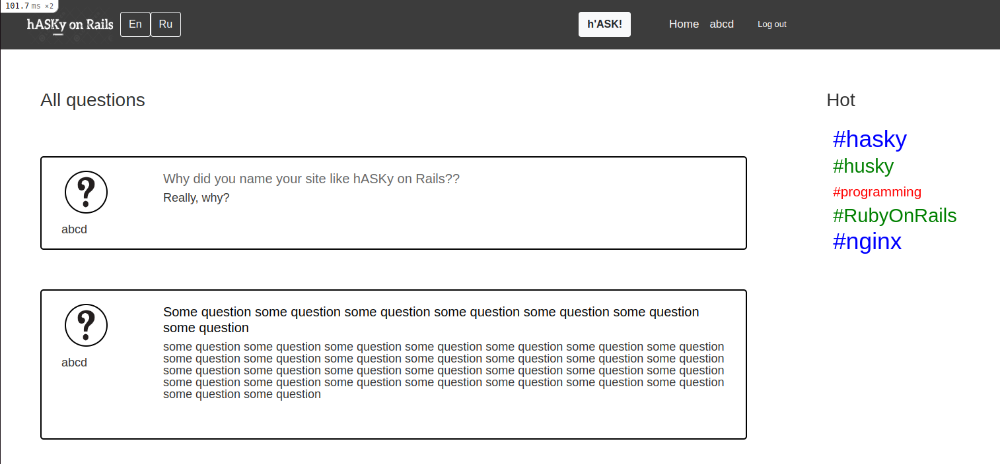

# Веб-сервис вопросов и ответов «Hasky on Rails»

Многопользовательское приложение позволяет задавать интересующие вопросы в различных областях и получать ответы от других пользователей.

Является портом ранее созданного [Django-приложения](https://github.com/noMercy-q/Hasky)

## Бекэнд
Ruby 3.0, Rails 6, SQLite3

## Фронтэнд
HTML, CSS, Bootstrap

## Особенности
<ul>
    <li>Интернационализация (рус/англ)</li>
    <li>Пагинация</li>
    <li>Пользовательские сессии</li>
    <li>CRUD в рамках прав доступа</li>
</ul>
 

___

  

# Q&A web service «Hasky on Rails»
The multi-user application allows you to ask questions of interest in various fields and receive answers from other users.

Is a port of a previously created [Django application](https://github.com/noMercy-q/Hasky)

## Backend
Ruby 3.0, Rails 6, SQLite3

## Fronend
HTML, CSS, Bootstrap

## Features
<ul>
    <li>Internationalization (ru/en)</li>
    <li>Pagination</li>
    <li>User sessions</li>
    <li>CRUD within access rights</li>
</ul>
 

